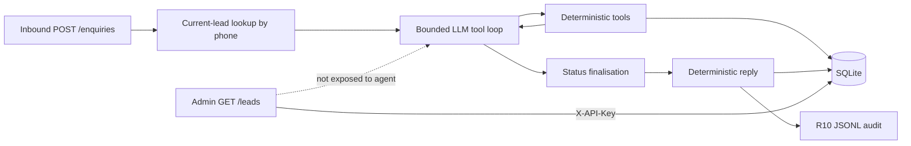

# RafterFlow

Bounded AI lead-intake backend for the fictional Summit Roofing Co. (Ideaboat Solutions LLP assessment: AI Lead Intake Agent).

## Why this design

**LLM interprets language. Deterministic code owns business commitments.**

The model extracts stated customer facts and chooses when to call tools. Python owns service-area membership, pricing arithmetic, inspection booking, status transitions, customer-facing business wording, and side effects (on-call notify, enquiry audit). Missing facts stay `null`. Business time uses fixed `REFERENCE_NOW`, not the host clock.

## Quick start

Requires Docker and a tool-capable OpenAI-compatible LLM endpoint.

1. Copy environment template and set LLM values (and change the admin key):

```bash
copy .env.example .env   # Windows
# cp .env.example .env   # macOS / Linux
```

Edit `.env`: set `LLM_BASE_URL`, `LLM_API_KEY`, `LLM_MODEL`. Optionally change `ADMIN_API_KEY` from the placeholder.

2. Build and run (seeds Appendix baseline into a fresh volume):

```bash
docker compose up --build
```

3. In another terminal, with the same repo Python env (or any environment that can import the project / run the script):

```bash
python run_eval.py
```

Completely clean Docker rerun (wipes SQLite + log volume, then reseeds baseline):

```bash
docker compose down -v
docker compose up --build
```

### Local Python path (optional)

```bash
python -m venv .venv
# Windows: .venv\Scripts\activate
# Unix:    source .venv/bin/activate
pip install -r requirements.txt
copy .env.example .env   # then edit LLM settings
python scripts/seed.py --reset
uvicorn app.main:app --reload
```

## Run the evaluation

```bash
python run_eval.py
```

HTTP-only black-box client: posts every Appendix F message in order to `POST /enquiries` and writes `eval.md` from the real responses. It does **not** reset the database and does **not** use `ADMIN_API_KEY`.

The service must already be running from a fresh Appendix-seeded baseline (new Docker volume, or `python scripts/seed.py --reset` before a local server). Override the target with `EVAL_BASE_URL` or `--base-url`.

## API

| Method | Path | Auth |
|--------|------|------|
| `GET` | `/health` | none |
| `POST` | `/enquiries` | none (customer enquiry) |
| `GET` | `/leads` | `X-API-Key` header = `ADMIN_API_KEY` |
| `GET` | `/leads/{lead_id}` | `X-API-Key` |
| `GET` | `/leads?status=` | optional filter; same key |

Do not put API keys in query strings. Do not commit real keys.

## Architecture



Admin is a separate trusted HTTP boundary. The agent tool whitelist has no list/search-leads capability.

## Authoritative data flow

1. Assessment appendices are transcribed into `data/business_rules.json`.
2. `scripts/seed.py` / container entrypoint load that file into SQLite.
3. Deterministic tools read seeded tables (areas, rates, slots, policies).
4. The model never embeds business rates or invents slots.
5. Persisted lead fields are the authoritative inputs to area and pricing tools; tool-call argument spoofing cannot override `lead.postcode` or pricing facts.

## Tool boundaries

| Tool | Role |
|------|------|
| `capture_lead_details` | Record only stated customer facts into allowlisted fields |
| `check_service_area` | Appendix B lookup using persisted `lead.postcode` |
| `estimate_price` | Appendix C arithmetic from lead facts |
| `mark_emergency` / `notify_on_call` | Appendix E emergency path + notifications.log |
| `get_policy` | Exact Appendix E policy topics |
| `mark_out_of_scope` | Decline non-offered services |
| `book_inspection` | Atomic free→booked update on Appendix D slots only |

The model selects tools; code validates and executes them.

## Reliability and security

Concrete controls in this codebase (not marketing claims):

- Bounded tool loop with a single recovery nudge for unresolved area/price
- Fail-closed: no invented quotes when authoritative tools never ran
- Current-customer-only model context (no cross-lead history)
- No admin tools in the agent runtime
- Admin API protected by `X-API-Key` (constant-time compare)
- Atomic conditional booking `UPDATE ... WHERE status='free'`
- Fixed `REFERENCE_NOW` for business time; monotonic host timer for latency only
- Deterministic pricing and reply composition
- Prompt-injection isolation tested (no admin/list capability)
- R10 enquiry audit JSONL separate from emergency notifications.log

## Evaluation

- Black-box Appendix F runner: `python run_eval.py` → `eval.md`
- Automated invariant checks with honest failure notes
- Adversarial review: [docs/ADVERSARIAL_REVIEW.md](docs/ADVERSARIAL_REVIEW.md)
- Offline suite: `pytest` (scripted LLM; no network)

## Key design decisions

- **Direct tool loop, not LangGraph** — assessment scope needs a bounded, inspectable loop, not a graph framework.
- **SQLite** — matches assessment scale and three-command/Docker reproducibility; not a claim of distributed production readiness.
- **Deterministic customer replies** — business commitments stay in code so wording cannot invent prices or slots.
- **No RAG** — policies and rates are finite appendix tables, not retrieval corpora.
- **DB-backed reference rules** — one seed path from `business_rules.json`.
- **Conditional SQL booking** — avoids check-then-write races under concurrent bookers.

## Assumptions

- One continuing lead per phone for this assessment (R7 memory).
- Nearest free slots: absolute temporal distance from the requested time; ties prefer later; max three; never invent slots.
- Brisbane offset for the supplied reference period is UTC+10 (no DST in the assessment window).
- Service area is decided by postcode only (suburb text does not override).
- Online figures are estimates only (Appendix E quote policy).

## Known limitations

- SQLite is assessment-scale, not a multi-region production store.
- One phone → one continuing lead; not a full multi-job CRM.
- JSONL audit append and SQLite commit are not one atomic distributed transaction.
- Natural-language quality still depends on the chosen tool-capable LLM.
- Filesystem JSONL logs are assessment-grade, not production observability.
- No real WhatsApp, calendar, or on-call paging integration.
- No production retention/redaction policy for customer PII.

## What I would build with one more week

These are not required for the assessment to function:

- Postgres (or equivalent) with clearer operational backups
- Real WhatsApp/webhook adapter
- Calendar / inspection scheduling integration
- Production notification channel (SMS/PagerDuty/etc.)
- CI for pytest + Docker build
- Structured observability (request ids, metrics)
- Broader LLM eval corpus beyond Appendix F
- PII retention/redaction controls
- Human-review queue for uncertain cases

## Time spent

See [TIME_LOG.md](TIME_LOG.md). Hours are marked for candidate confirmation before submission.

## Environment variables

See `.env.example`. Reviewers typically must set:

- `LLM_BASE_URL`, `LLM_API_KEY`, `LLM_MODEL` — required for live enquiries / eval
- `ADMIN_API_KEY` — change from the placeholder before any shared use

`REFERENCE_NOW` should stay at the assessment value unless you intentionally change the business clock. Docker Compose overrides `DATABASE_URL` and log paths onto the `/data` volume.
